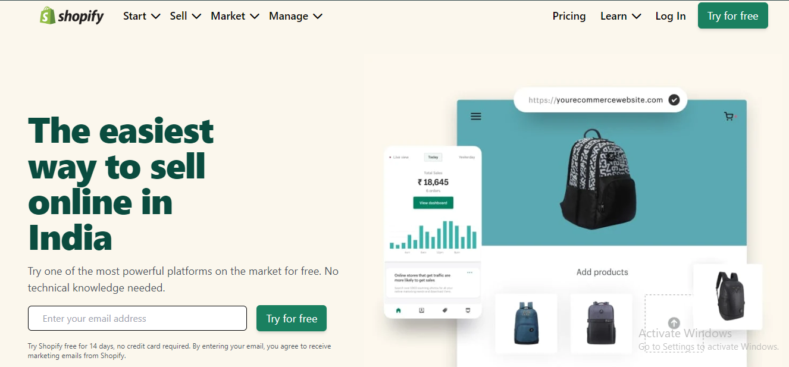

# Project 17 : Shopify_UI_Clone-Tailwind_CSS

### What I Learned from this Project?

- Learned how to use tailwind classes. 
- Learned about various CSS classes

### This project took around 8 hours to complete.

### Project Link : [Link](https://shopify-ui-clone-dashboard.netlify.app/)

### Screenshot :

